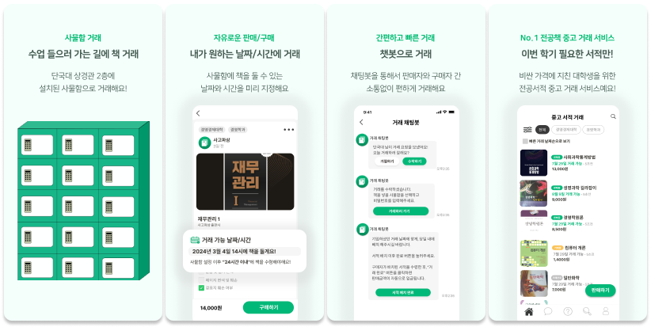
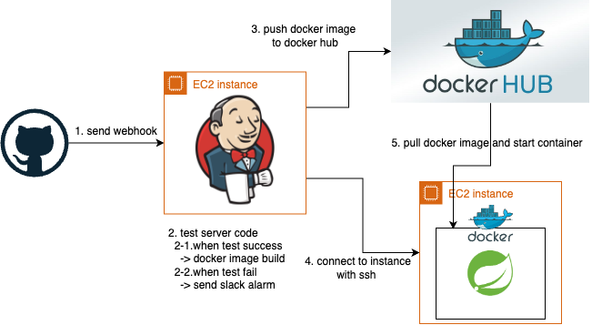

# 사고파삼 비대면 챗봇 기반 중고서적 거래 플랫폼



## 소개
- **'사고파삼'** 프로젝트는 대학생들의 전공서적 비용 문제와 불법 제본 문제에 대한 인식에서 시작하였습니다.
- 알바몬의 설문 결과(2020 알바몬 자체 설문조사 결과)에 따르면, 대학생의 평균 월 생활비 중 전공서적 비용이 상당한 부분을 차지한다고 합니다.
- 이로 인해 전공서적을 불법 제본하는 사례가 늘어나고 있으며, 이러한 불법 행위는 저작권 침해뿐만 아니라 출판 및 콘텐츠 산업 시장까지 침체시키는 결과를 초래합니다.
- 기존의 중고 거래 플랫폼의 문제점들을 해결하여, 
- 안전하고 합리적인 가격에 빠르게 거래할 수 있는 플랫폼을 만들어 보고자 시작하게 되었습니다.

---

## 개발자

|  |  |
|:----------------------------------------------------------------------------:|:----------------------------------------------------------------------------:|
|                      [박재완](https://github.com/wan2daaa)                      |                    [정경주](https://github.com/gyeongju1230)                    |
|                    **Backend, Frontend(사용자 앱, 관리자 사이트)**                     |                           **Frontend**(사용자 앱, PWA)                           |

## 기능
복잡한 의사소통 과정과 사기 거래 때문에 불편했던 중고거래, 중고거래의 불편함을 해소한 **사고파삼**에서는 쉽고 빠르게 필요했던 전공책을 사고 팔 수 있습니다.

1. **구매자와 판매자 간 의사소통이 필요없는 챗봇 거래**
   - 모든 거래 과정은 채팅봇으로 진행되며, 직접적인 소통 없이 버튼만으로 거래가 가능해요.
2. **내가 원하는 날짜와 시간에 거래, 비대면 거래**
   - 판매자는 사물함에 책을 배치할 수 있는 날짜와 시간을 미리 지정할 수 있어요.
   - 판매자는 설정한 날짜에 서적을 배치하고, 구매자는 서적을 수령하면 돼요.
3. **카테고리와 검색으로 인한 쉬운 서적 검색**
4. **거래 당일날 잊지않고 알림이 와요**
   - 거래 당일날 리마인드 알림을 보내서 거래를 잊지 않게 도와요.
5. **거래 진행을 깜빡하면 알림이 와요**
   - 입금 전, 등록 전 등 거래 진행을 깜빡하면 알림을 보내서 거래를 빠르게 진행할 수 있어요.


---

## Skills

#### Language


#### Dependency


#### Database


#### Infra


#### Monitoring


## 프로젝트 구조
```text
.
├── java
│   └── team
│       └── dankookie
│           └── server4983
│               ├── book
│               │   ├── constant
│               │   ├── controller
│               │   ├── domain
│               │   ├── dto
│               │   ├── repository
│               │   │   ├── bookImage
│               │   │   ├── locker
│               │   │   ├── mypageBookPurchaseDetail
│               │   │   ├── mypageBookSalesDetail
│               │   │   └── usedBook
│               │   └── service
│               ├── chat
│               │   ├── constant
│               │   ├── controller
│               │   ├── domain
│               │   ├── dto
│               │   ├── exception
│               │   ├── handler
│               │   ├── repository
│               │   └── service
│               ├── common
│               │   ├── annotation
│               │   ├── config
│               │   ├── domain
│               │   ├── dto
│               │   ├── exception
│               │   ├── filter
│               │   └── init
│               ├── fcm
│               │   ├── dto
│               │   └── service
│               ├── jwt
│               │   ├── constants
│               │   ├── domain
│               │   ├── dto
│               │   ├── repository
│               │   ├── resolver
│               │   ├── service
│               │   └── util
│               ├── member
│               │   ├── constant
│               │   ├── controller
│               │   ├── domain
│               │   ├── dto
│               │   ├── repository
│               │   │   └── memberImage
│               │   └── service
│               ├── s3
│               │   ├── dto
│               │   └── service
│               ├── scheduler
│               │   ├── constant
│               │   ├── entity
│               │   ├── repository
│               │   └── service
│               └── sms
│                   ├── constant
│                   ├── dto
└──                 └── service


```

## 테스트, 배포 자동화 프로세스



1. webhook을 통해 Jenkins가 설치된 EC2 인스턴스에 push 이벤트를 전송해요
2. Jenkins는 전달받은 이벤트를 감지하고, 빌드 및 테스트를 진행해요
    1. 테스트가 성공하면, Docker 이미지를 빌드하고, docker hub에 push해요
    2. 테스트가 실패하면, slack으로 알림을 보내요
5. Jenkins에서 ssh를 통해 EC2 인스턴스에 접속한 후, docker 컨테이너를 실행해요
